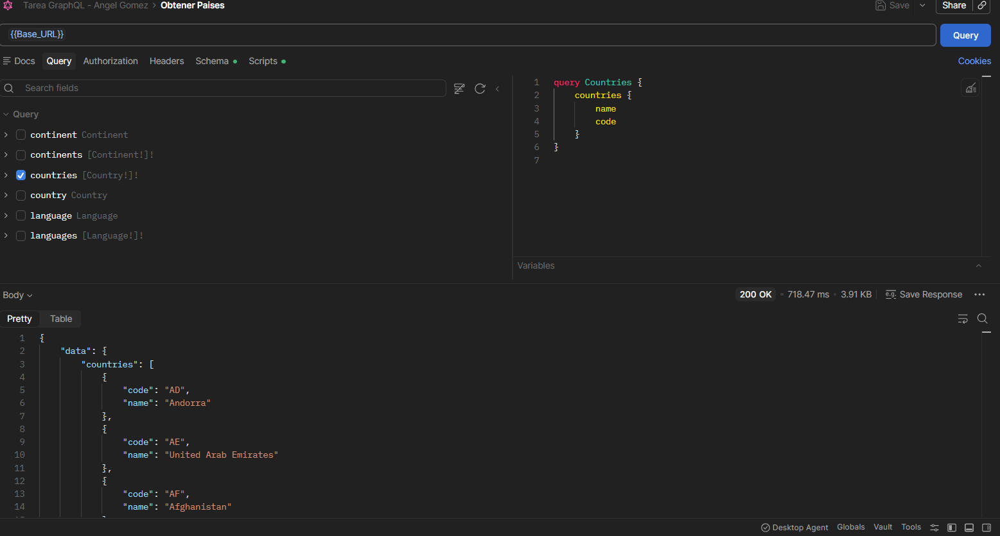
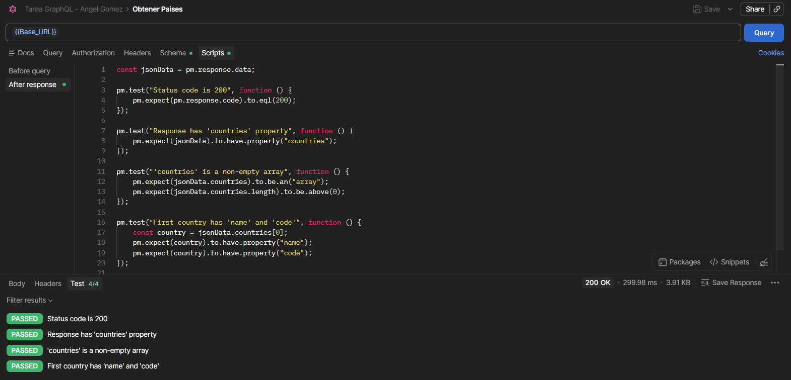
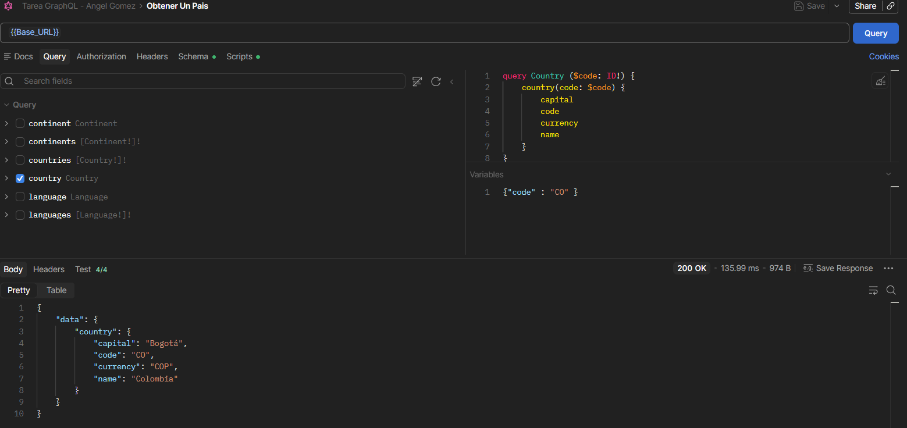
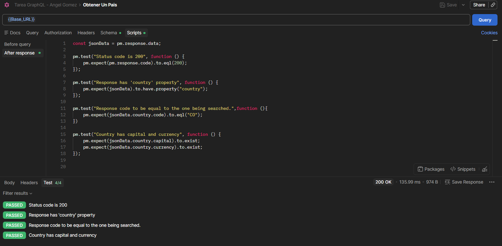
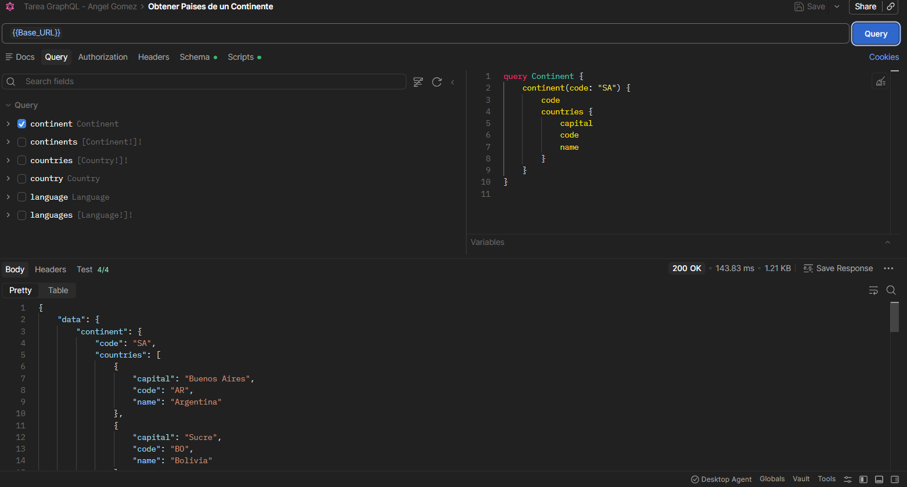
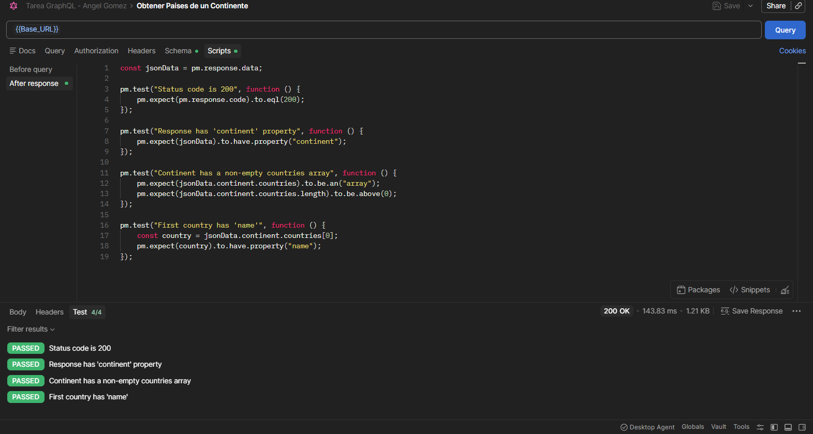
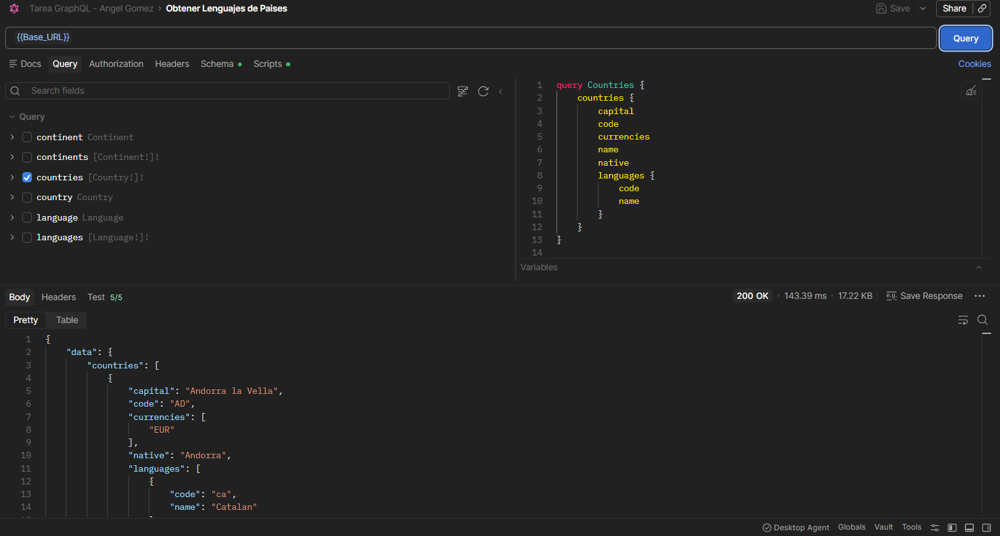
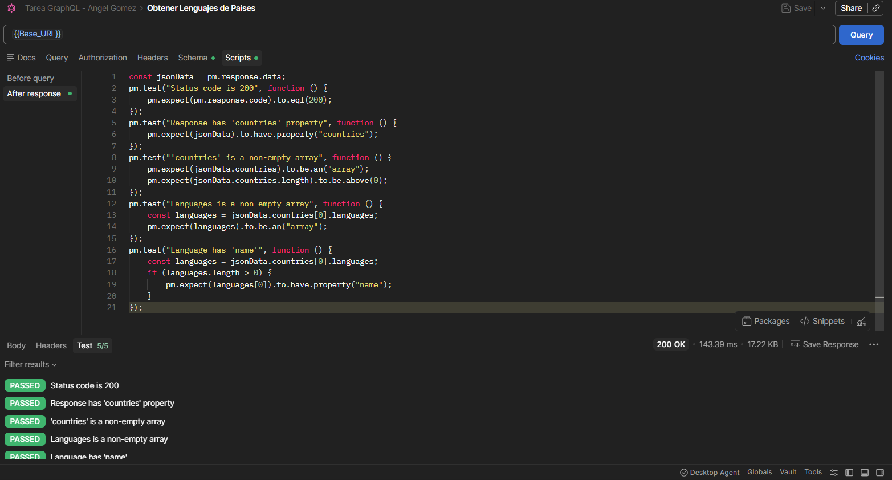
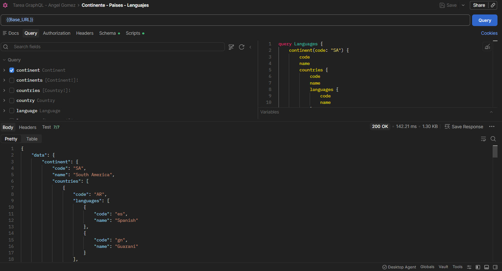
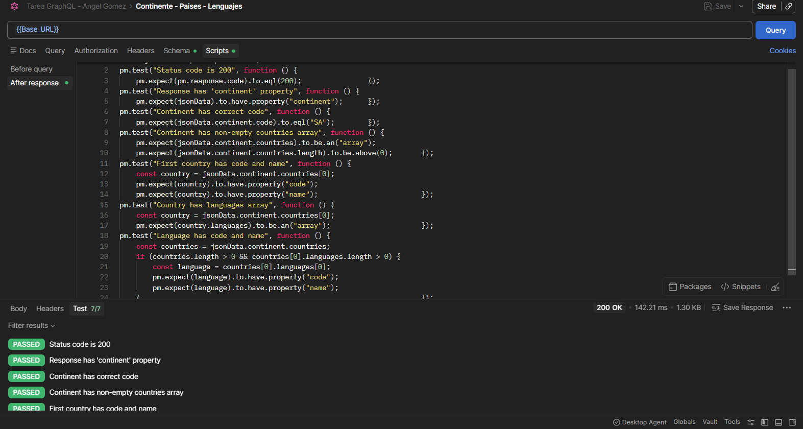

# Curso: Ingeniería de Software II
# - Laboratorio GraphQL con Postman

### Estudiante:  Ángel David Gómez Pastrana
## Descripción del trabajo en Postman

Para esta práctica, la API que se usó fue la API de [Countries GraphQL](https://countries.trevorblades.com/) de Trevor Blades, la cual es una API de uso práctico para aprender a usar GraphQL y su tipo de consultas. Esta API trae información de continentes y países, la cual está totalmente disponible para hacer cualquier tipo de consultas.

| Request | ¿De qué se trata? | Código de respuesta | Test |
|---|---|---|---|
| **1** | Buscar todos los países disponibles y su código. |  |  |
| **2** | Búsqueda filtrada por un código específico usado como variable de un país y obtener su capital, código, moneda y nombre. |  |  |
| **3** | Búsqueda filtrada de un continente en específico, pasado explícitamente en la búsqueda, e información anidada sobre los países de este continente. |  |  |
| **4** | Búsqueda anidada de los lenguajes de los países disponibles, junto con la capital, código, monedas, nombre y nombre del país en su lenguaje nativo. |  |  |
| **5** | Obtener el lenguaje de los países de un continente específico; el código del continente se pasa explícitamente en la query. |  |  |

### Nota: 
En caso de que las imágenes se vean muy pequeñas, estas se encuentran en la carpeta `/images` donde su nombre es ``R{i}_Test`` o ``R{i}_Response``, que significa que es la captura del request i, la parte del test o de response.

## ¿Qué diferencia encontraste vs REST?

En contraste con REST, podemos ver que GraphQL tiene muchas diferencias. Para empezar, GraphQL usa una misma URL y un mismo endpoint para todas las queries, mientras que REST debe tener un endpoint para cada request. A favor de REST, esa request le puedes cambiar su tipo, y creo que eso es útil cuando se necesita editar o eliminar información a través del endpoint que estás usando. Otra diferencia clave es que en REST es el servidor el cual te manda la información; esto hace que usualmente lleguen o más datos de los que se necesitan, o menos. Esto causa un uso innecesario de recursos como red y tiempo; además, puede requerir el uso de más de una consulta para conseguir toda la información necesaria. En GraphQL se piden los datos necesarios y es el usuario quien decide qué necesita y qué no.

También se puede agregar que GraphQL permite búsquedas anidadas muy sencillamente, mientras que en REST hay que tener cuidado con los parámetros enviados en la query. Podemos decir que un punto a favor de REST es que el body del query es mucho más sencillo de armar.

Podemos decir que, en general, REST es más sencillo al inicio y más entendible de usar, mientras que GraphQL es un sistema más eficiente pero que requiere un poco más de entendimiento de cómo usarlo correctamente.

## ¿Cuántos requests REST necesitarías para reemplazar tu query más compleja?

Mi query más compleja es la query 5: obtener el lenguaje de los países de un continente específico, en la cual el código del continente se pasa explícitamente en la query. Para determinar cuántas requests REST se necesitarían para obtener la misma información, depende de cómo esté armada la API REST; podría ser una sola request si se maneja como parámetros (por ejemplo, traer los países de un dado continente y toda su información), pero esto nos daría mucha más información de la que necesitamos y luego habría que filtrarla. Otra opción es que haría falta una request por anidación; es decir, en un supuesto endpoint `continent/SA/` necesitaría una request para traer los países y otra para traer los lenguajes. Así que, al menos, sabemos que son 2 o más requests, y habría que filtrar información para que fuera exactamente igual. Por tanto, en este caso GraphQL hace un trabajo más eficiente.

## ¿En qué proyecto real usarías GraphQL?

Ya vimos que GraphQL es mejor cuando los datos son complejos, hay muchas relaciones y distintas variables; por lo tanto, en proyectos que cumplan estas características, por ejemplo, aplicaciones de tipo red social, aplicaciones de comercio electrónico que necesitan información relacionada que no sería fácil de sacar a través de requests de tipo REST, o por ejemplo aplicaciones de celular en las cuales la red pueda ser un problema, dada la eficiencia en cuestión de elementos como red y tiempo.