# Curso: Ingeniería de Software II
# - Laboratorio REST por consola y SSH

### Estudiante:  Ángel David Gómez Pastrana
## Descripción del trabajo 

Primero completamos los to-do en el archivo de `servidor.js`, para el primer endpoint quedó así:

- 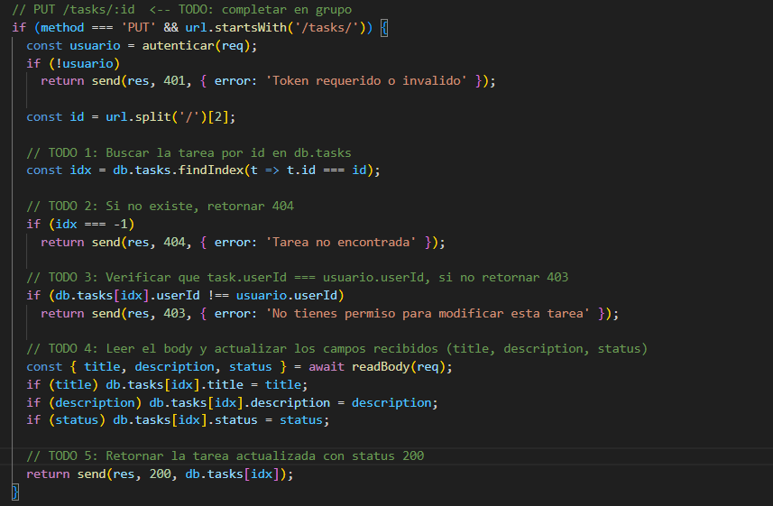

Y para el segundo endpoint:

- 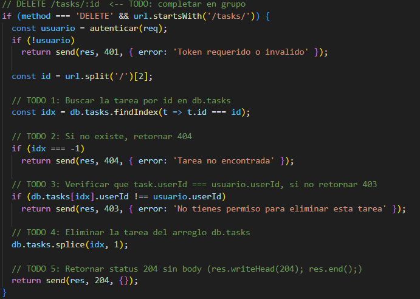

Ponemos a correr el servidor en una terminal propia con: `node server.js` desde este root y ahora revisamos y validamos los endpoints con los siguientes comandos:

**Resumen de pasos y comandos**

- Registro de usuario — POST /auth/register, Login y obtención de token — POST /auth/login

	- Comando Registro (PowerShell): `Invoke-RestMethod -Method POST -Uri http://localhost:3000/auth/register -ContentType "application/json" -Body '{"username":"ana","email":"ana@test.com","password":"1234"}'`
    - Comando Login (PowerShell): `$Invoke-RestMethod -Method POST -Uri http://localhost:3000/auth/login -ContentType "application/json" -Body '{"email":"ana@test.com","password":"1234"}'`

    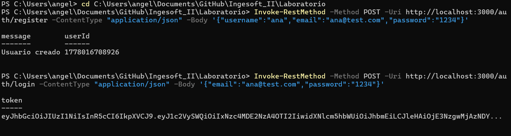

- Guardado y verificación del token POST /auth/login 
	- Comando guardado (PowerShell): `$token = (Invoke-RestMethod -Method POST -Uri http://localhost:3000/auth/login -ContentType "application/json" -Body 	'{"email":"ana@test.com","password":"1234"}').token`
	- Comando de verificación (PowerShell): `$token` 
  
  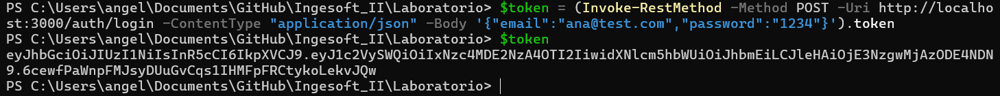 

- Listar tareas con y sin token — GET /tasks (requiere token)
    - Comando sin token (PowerShell): `Invoke-RestMethod -Method GET -Uri http://localhost:3000/tasks` 
	- Comando con token (PowerShell): `Invoke-RestMethod -Method GET -Uri http://localhost:3000/tasks -Headers @{Authorization="Bearer $token"}`
 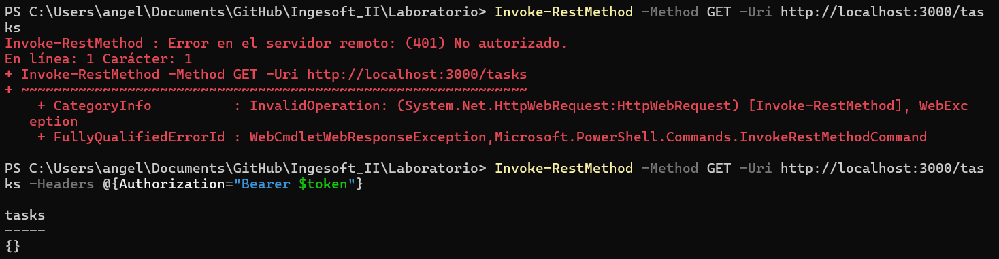

- Crear tarea en variable, verificar variable y actualizar / eliminar tareas, por último listar.
	- Crear (POST): `$tarea = (Invoke-RestMethod -Method POST -Uri http://localhost:3000/tasks -ContentType "application/json" -Headers @{Authorization="Bearer $token"} -Body '{"title":"Estudiar JWT","description":"Practicar"}')`
	- Verificar: `$tarea`
	- Actualizar (PUT): `Invoke-RestMethod -Method PUT -Uri http://localhost:3000/tasks/$($tarea.id) -Headers @{Authorization="Bearer $token"; "Content-Type"="application/json"} -Body (@{title="Actualizada"; status="completed"} | ConvertTo-Json)` 
	- Eliminar (DELETE): `Invoke-RestMethod -Method DELETE -Uri http://localhost:3000/tasks/$($tarea.id) -Headers @{Authorization="Bearer $token"}`
	- Listar: `Invoke-RestMethod -Method GET -Uri http://localhost:3000/tasks -Headers @{Authorization="Bearer $token"}`
  
  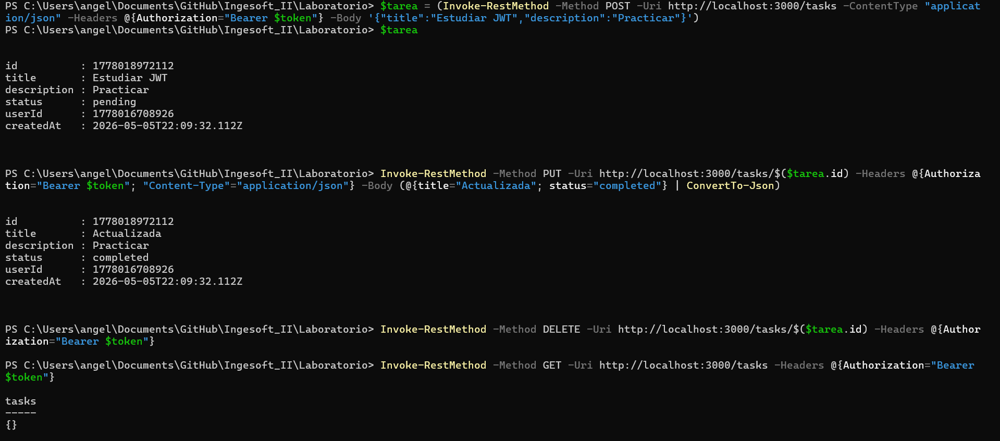

Luego de terminar esto, modificamos el servidor para que escuche en toda la red, de esta forma:

| Antes | Después |
|--------------|--------------|
| 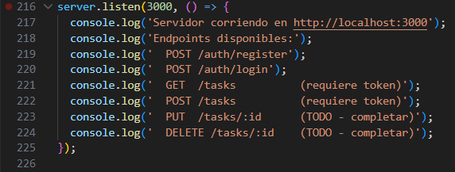 | 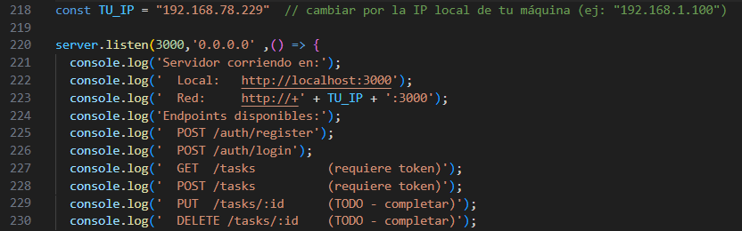 |

Después de eso, corrimos el servidor con `node server.js` desde este root. Como también usamos un dispositivo móvil para conectarnos por SSH, instalamos `Termius` y configuramos OpenSSH en Windows con permisos de administrador.

**Configuración SSH**

- Instalar OpenSSH Server
	- Comando (PowerShell como administrador): `Add-WindowsCapability -Online -Name OpenSSH.Server~~~~0.0.1.0`

- Verificar la instalación
	- Comando (PowerShell): `Get-Service sshd`

- Iniciar el servicio SSH
	- Comando (PowerShell): `Start-Service sshd`

- Confirmar que el servicio quede en `running`
	- Comando (PowerShell): `Get-Service sshd`

Luego creamos la conexión en `Termius` usando el `host IP`, las credenciales del usuario creado y el puerto por defecto `22`. En el dispositivo móvil aparece la terminal de conexión.

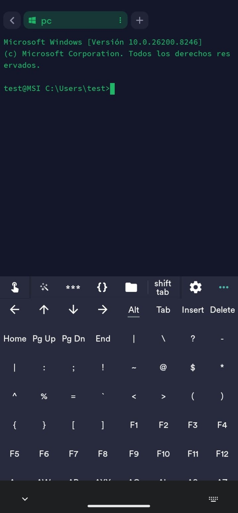

Una vez dentro, ejecutamos `powershell` para cambiar de `cmd` a PowerShell y repetimos el flujo de pruebas: registro, inicio de sesión, creación, actualización, eliminación y listado de tareas.

**Pruebas desde SSH / móvil**

- Registro de usuario, inicio de sesión y obtención de token
	- Comando Registro: `Invoke-RestMethod -Method POST -Uri http://localhost:3000/auth/register -ContentType "application/json" -Body '{"username":"angel","email":"angel@test.com","password":"1234444"}'`

	- Comando de inicio de sesión y obtención de token: `$login = Invoke-RestMethod -Method POST -Uri http://localhost:3000/auth/login -Headers @{"Content-Type"="application/json"} -Body '{"email":"angel@test.com","password":"1234444"}'`
	- Comando de verificación de token: `$token = $login.token`
  
  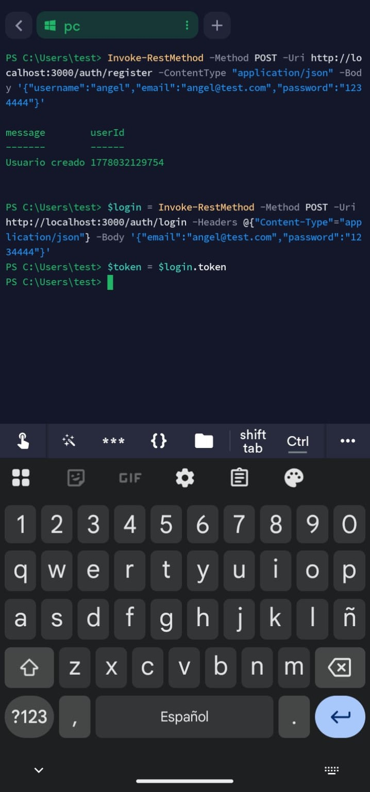

- Crear tarea, verificarla y listarla
	- Comando crear tarea: `$tarea = (Invoke-RestMethod -Method POST -Uri http://localhost:3000/tasks -ContentType "application/json" -Headers @{Authorization="Bearer $token"} -Body '{"title":"Comandos REST desde el celular","description":"TO-DO"}')`
	- Comando verificarla: `$tarea`
	- Comando listarla: `Invoke-RestMethod -Method GET -Uri http://localhost:3000/tasks -Headers @{Authorization="Bearer $token"}`
  
  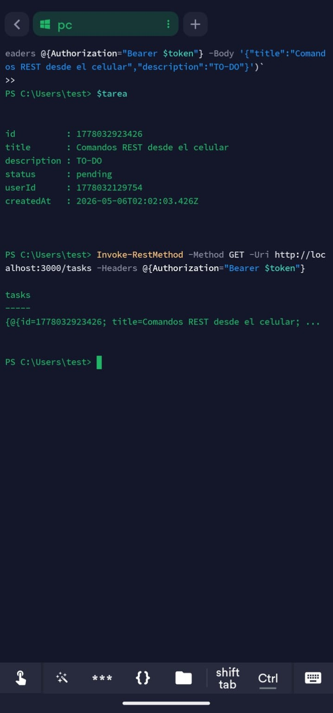

- Cambiar información de la tarea
	- Comando de actualización: `Invoke-RestMethod -Method PUT -Uri http://localhost:3000/tasks/$($tarea.id) -Headers @{Authorization="Bearer $token";"Content-Type"="application/json"} -Body (@{title="TareaCambiada"; status="Terminada"} | ConvertTo-Json)`
  
  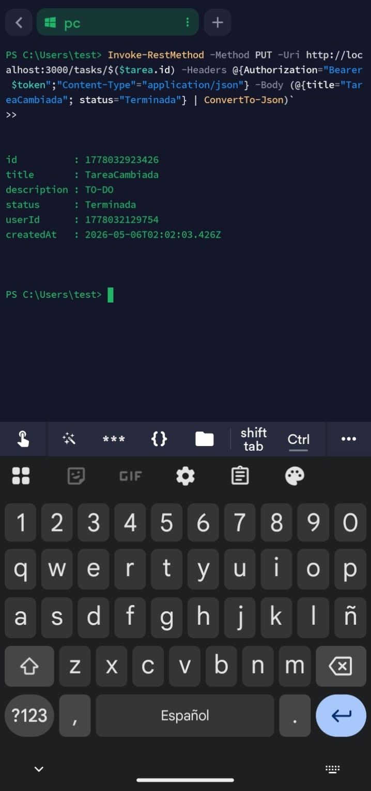

- Eliminar tarea y listar de nuevo para comprobar la eliminación
	- Comando eliminar: `Invoke-RestMethod -Method DELETE -Uri http://localhost:3000/tasks/$($tarea.id) -Headers @{Authorization="Bearer $token"}`
	- Comando listar: `Invoke-RestMethod -Method GET -Uri http://localhost:3000/tasks -Headers @{Authorization="Bearer $token"}`
  
  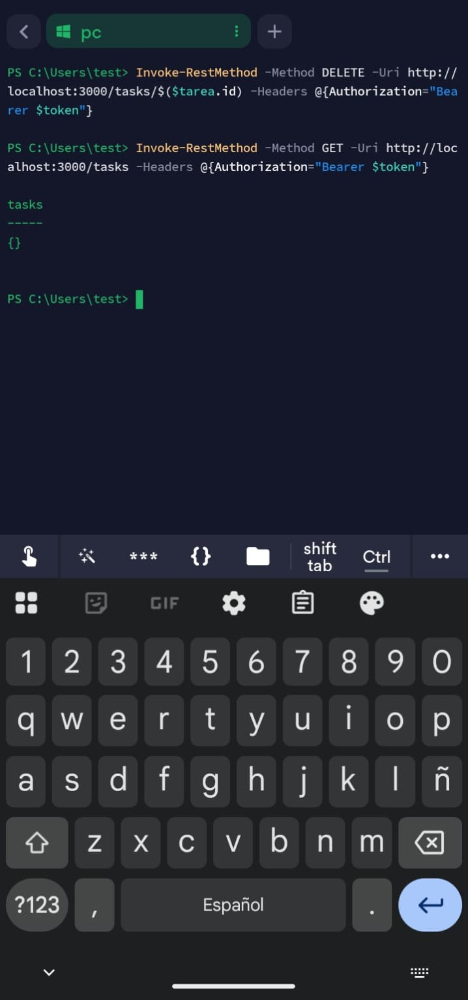

