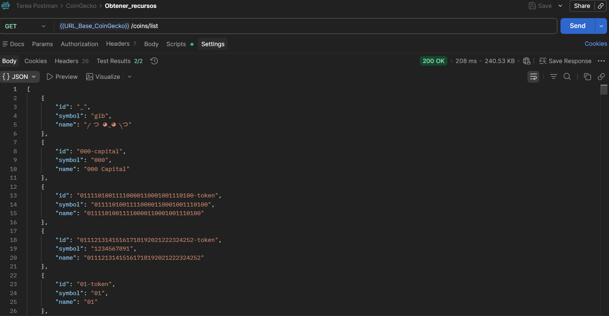
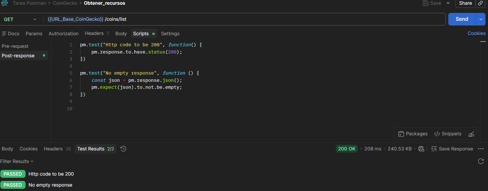
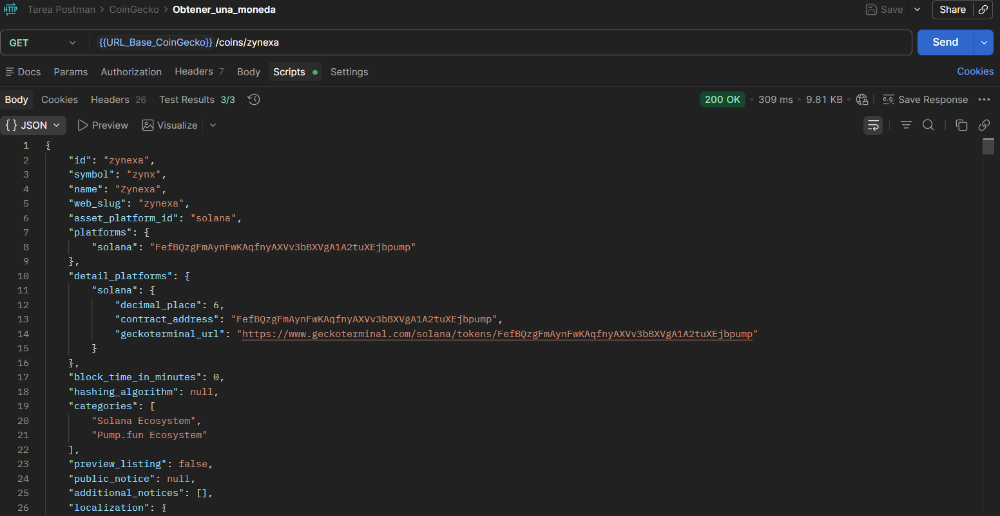
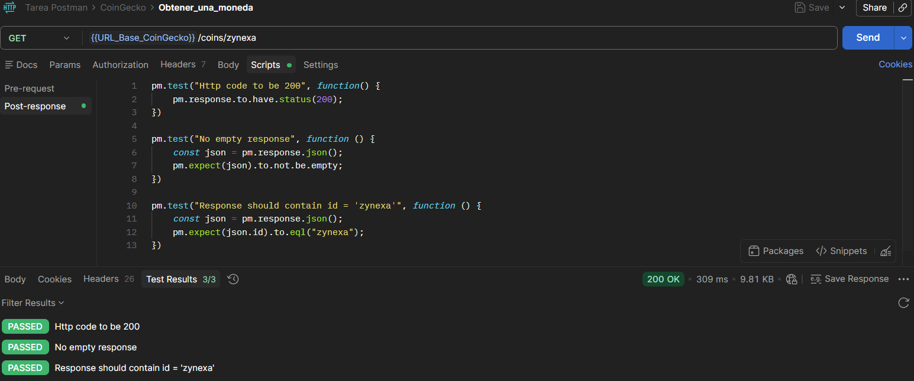
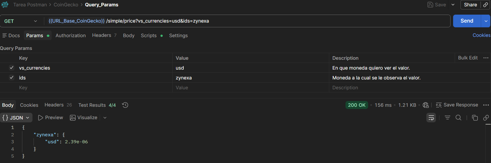
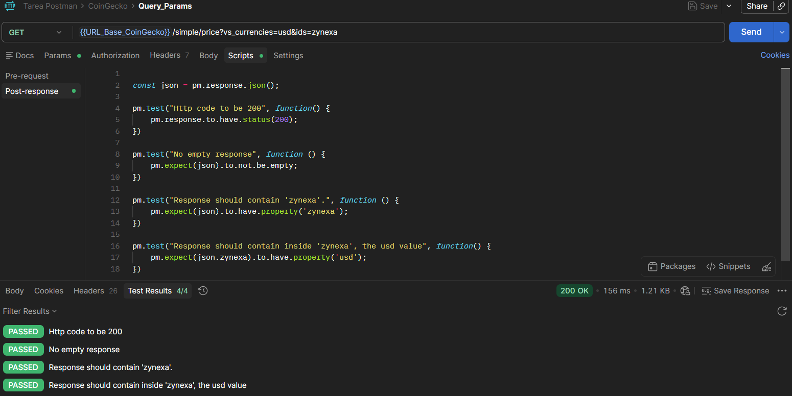
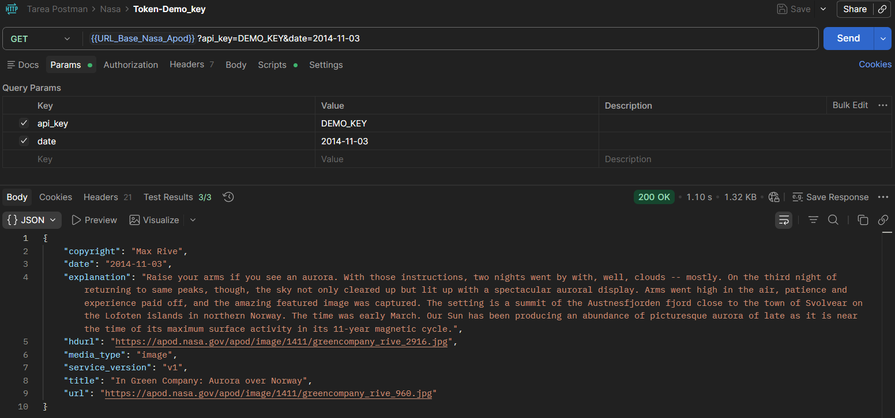
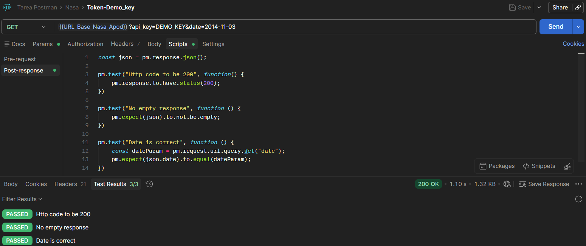
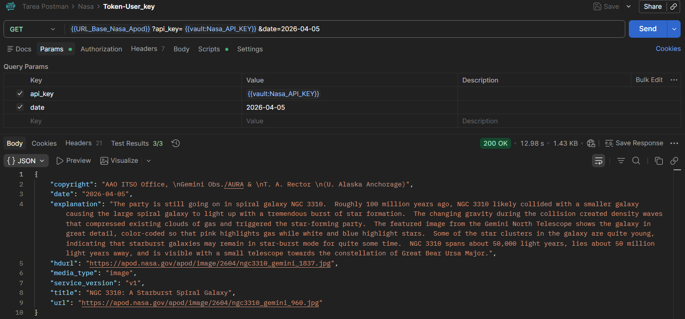
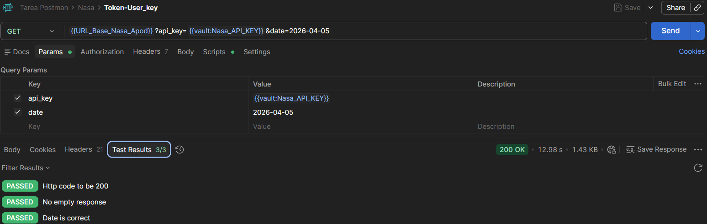

# Curso: Ingeniería de Software II
# - Laboratorio REST con Postman

### Estudiante:  Ángel David Gómez Pastrana
## ¿Qué API elegiste y por qué?

Para el laboratorio de REST, usé 2 APIs las cuales son [CoinGecko API](https://api.coingecko.com/api/v3) y [NASA APOD API](https://api.nasa.gov/planetary/apod), dado que la API de CoinGecko es una API de criptomonedas y finanzas y puede incluso llegar a ser una API que consuma a futuro; sin embargo, quería aprender a usar un token o un API key y esto no se podía en esta API de CoinGecko; ahí es donde entra la API de la NASA, la cual tiene dos formas de usarse, con una `DEMO_KEY` que es básicamente una llave que no requiere que el usuario se registre y la llave del usuario registrado o un API key personal.
## ¿Qué datos devuelve?

En la [documentación de la API de CoinGecko](https://docs.coingecko.com/v3.0.1/reference/authentication) se puede ver explícitamente qué información es la que cada endpoint devuelve (son muchos), pero en general es información sobre criptomonedas, tasas de cambio entre ciertas monedas y criptomonedas, algo llamado tokens y además información sobre los históricos de estas criptomonedas. Los endpoints usados en los request de ejemplo son:
- **/coins/list:** Trae la lista de monedas en CoinGecko y algunos atributos como su ID y Symbol, entre otros.
- **/coins/{id}:** Trae información más específica de la moneda cuyo ID sea puesto en la URL.
- **/simple/price:** Trae la tasa de cambio de una moneda dada en otra; esto depende de los parámetros que se coloquen. En el request hay, por lo menos, 2 parámetros: 'ids' (la moneda de la cual quiero ver el precio) y 'vs_currencies' (la moneda en la cual quiero ver la tasa de cambio de la moneda puesta en ids).

Mientras que en la API de la NASA trae específicamente una imagen del día o un pequeño video dependiendo de los parámetros de la query, además de información sobre la imagen o video, tal como recurso, que es un diccionario con descripción sobre la imagen, la fecha, la URL y el campo `hdurl` (URL para ver la imagen en HD), entre otras.

En la [documentación de la API de la Nasa APOD](https://github.com/nasa/apod-api) se puede ver explícitamente qué atributos trae su endpoint.

El endpoint usado es:

- **/apod:** El cual, dependiendo de los parámetros y del API key, trae la información necesaria. Los usados fueron 'api_key' (en la cual se especifica si se usa `DEMO_KEY` o un API key personal) y 'date' (que especifica la fecha de la imagen que quiero consultar).
## ¿Usa token o no? ¿Qué tipo?

Únicamente la API de la NASA es la que usa token de tipo API key; esta puede ser generada al registrarse en https://api.nasa.gov/#signUp o puede usarse un parámetro llamado `DEMO_KEY`, que permite hacer consultas sin registrarse. En este caso, el token se pasa en la URL, lo cual no es totalmente seguro; pero, como es un token no tan importante y con `DEMO_KEY` se pueden hacer las consultas (al menos, según la documentación), y estas consultas no son de contenido privado o sensible, no es de mayor importancia.
## ¿Qué código de estado recibiste en cada request?

Principalmente los códigos de respuesta fueron 200 (Successful) cuando la request se enviaba correctamente; otras veces salía un 404 (Not Found) y el body de JSON contenía parámetros que especificaban el error de la request, especialmente cuando la URL no estaba bien escrita o terminada (principalmente en la API de CoinGecko). En la API de la Nasa me salió, mientras entendía el uso del token, un 403 (Forbidden) por credenciales inválidas. Acá muestro los screenshots de los test y de los request en particular con sus códigos 200 al hacerlo correctamente.

| Request | ¿De qué se trata? | Código de respuesta | Test |
|---|---|---|---|
| **1** | Buscar la lista de monedas de la API CoinGecko. |  |  |
| **2** | De la anterior consulta, elegí una moneda y ahora quiero información específica de esta moneda. |  |  |
| **3** | Quiero ver de esta moneda (Zynexa) su valor en USD. |  |  |
| **4** | Buscar imagen del día, sin token personal. |  |  |
| **5** | Buscar imagen del día, con token personal. |  |  |

### Nota: 
En caso de que las imágenes se vean muy pequeñas, estas se encuentran en la carpeta `/images` donde su nombre es ``R{i}_Test`` o  ``R{i}_Response``, que significa que es la captura del request i, la parte del test o de response.

## ¿Qué aprendiste diferente a JSONPlaceholder?

Principalmente el uso de los query parameters, los cuales sirven específicamente para hacer una búsqueda más precisa o modificar el tipo de información que se te responde al request. Además de eso, el uso de tokens y cómo guardarlos en un espacio seguro en Postman, para su uso controlado y para que, por ejemplo, no todo el equipo que tenga acceso a esos request pueda usar mi token personal.

